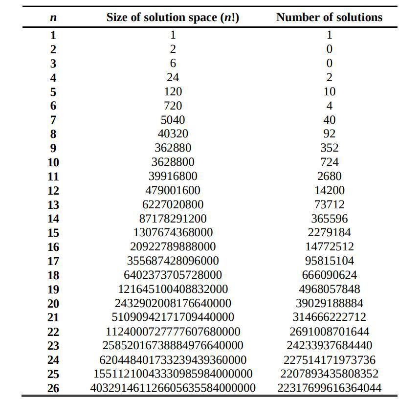
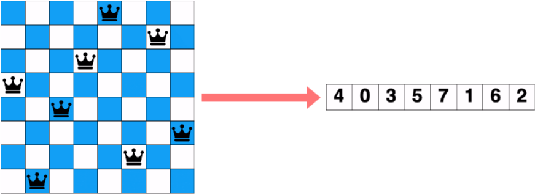
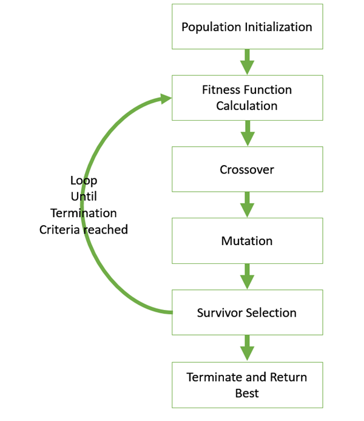
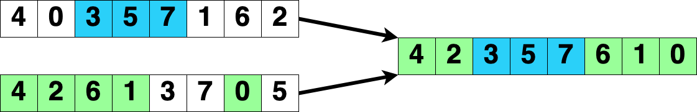
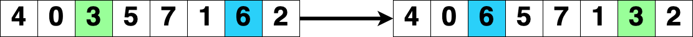
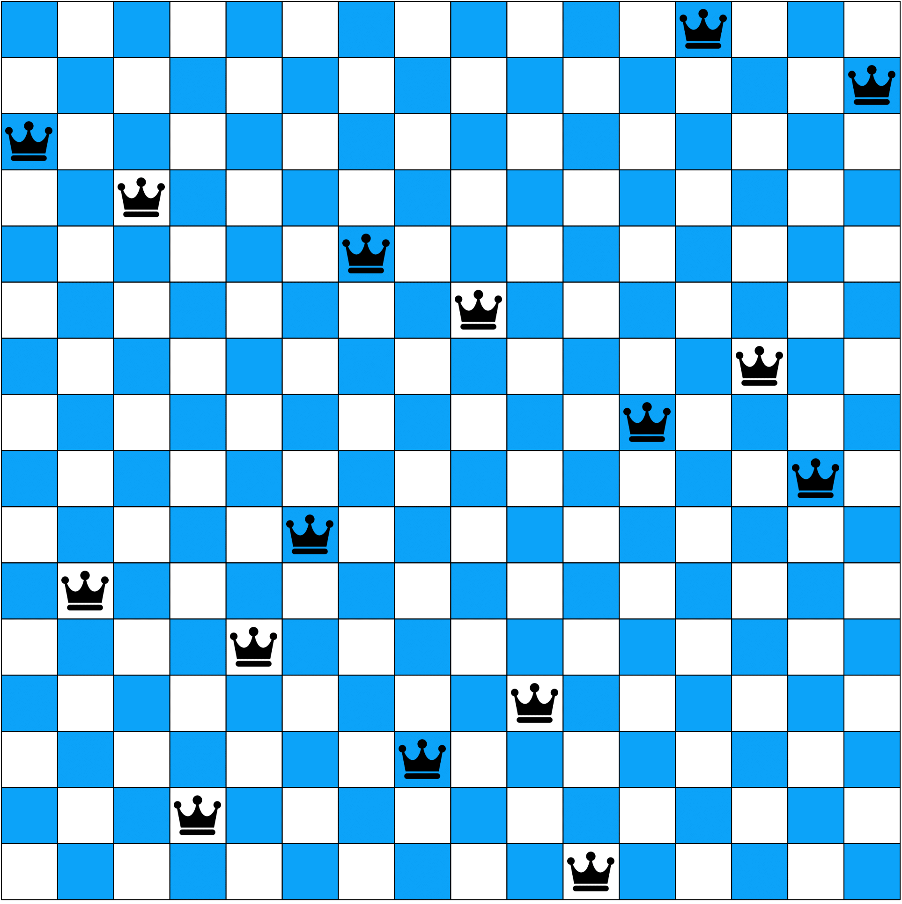
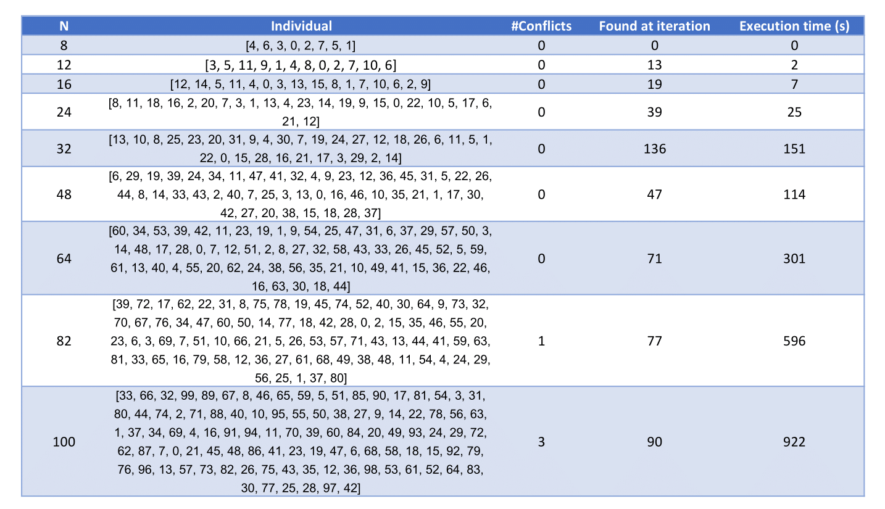

# Objective
This is a very simple python project that implements the idea of **Genetic Algorithms** in order to solve the N-queens problem.

# N-queens problem
Given a **NxN** chess board, the goal is to place N queens such that no two queens attack each other. This means that, according to chess rules, the queens must not be in the same row, column and diagonal. For example, board state on the **left** is a solution (0 conflicts), while board state on the **right** is not (4 conflicts).

&nbsp; &nbsp; &nbsp; &nbsp;&nbsp; &nbsp; &nbsp; &nbsp;&nbsp; &nbsp; &nbsp;

# State space restriction

Normally, if a queen can be placed in any free position in the board, the state space is of size $\frac{N^2!} {(N(N-1))!}$. For N=8, this number would be equal to **178,462,987,637,760**, which is very large. Since two queens placed on the same row or column are already in conflict, we can add the constraint that no two queens can be put in the same row and column. This new state space would be shrinked to the size $N!$, which for N=8 is equals to **40,320** (much smaller!). To have an idea of how the state space can grow with N, look at the following table:

# Board state encoding
The encoding of the board state is basically a fixed-length array of size N, where each position **p** has a value indicating the row position of queen in column p (bottom-top, starting from 0). Due to the considerations above about the state space, we'll use a permutation-based encoding (no repetitions in each array).

# Algorithm flow
The main structure of Genetic Algorithms is represented below.

The flow of execution is as follow:

1. Initialize *population* at random
2. while *new_gen*.size < *population*.size
    1. select two parents from *population*
    2. apply crossover to create 2 offsprings
    3. apply random mutation to the offsprings
    4. add the offsprings to *new_gen*
3. Repeat step 2 with *population* = *new_gen* till a termination criterion is met

# Selection
The parents selection used are *tournament* and *roulette wheel*. However, tournament ended up being the default as it always outperformed roulette wheel. Tournament selection basically consists in randomly sample a set of **k** individuals from the population, and select the one with the highest fitness.

# Crossover
The crossover operation used is *Davis' order* (OX), which is a **permutation-based** crossover. It is applied with probability *crossover_rate*. This particular crossover consists in selecting to points **p1** and **p2** from a parent, fixing the delimited substring into a child and fill all the remaining positions with the ones of the other parent (from left to right)

# Mutation
The mutation applied to the offsprings is simply the **swap** of two random positions (with probability *mutation_rate*). Example, green and blue positions are randomly chosen and swapped.

# Example of execution on 16-queens
An example of the execution of the algorithm on the 16-queens instance is shown below.

 As one can see, it was found the optimal solution, that is a board state with zero conflicts. Graphically, the solution is as follow:

# Experimental results for various N
The instances of the problem tested with this algorithm are **N= 8, 12, 16, 24, 32, 48, 64, 82, 100**, with the following empirically-chosen hyperparameters:

* **population size** = 1000
* **selection type** = ‘tournament’
* **crossover type** = ‘ox’
* **crossover rate** = 0.7
* **mutation rate** = 0.2
* **max generations** = 150

As per the summary table shown below, we ended up having optimal solutions for every N, except for **N=82** and **N=100**, for which (good) suboptimal solutions were found.

# References
https://www.tutorialspoint.com/genetic_algorithms/index.htm