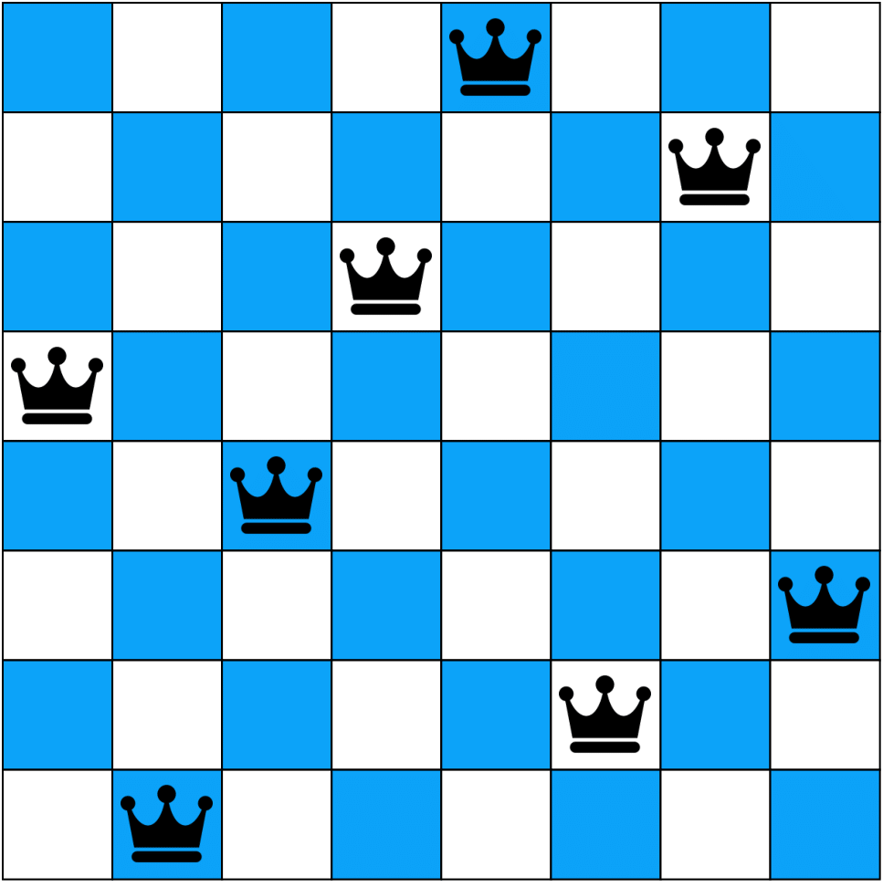
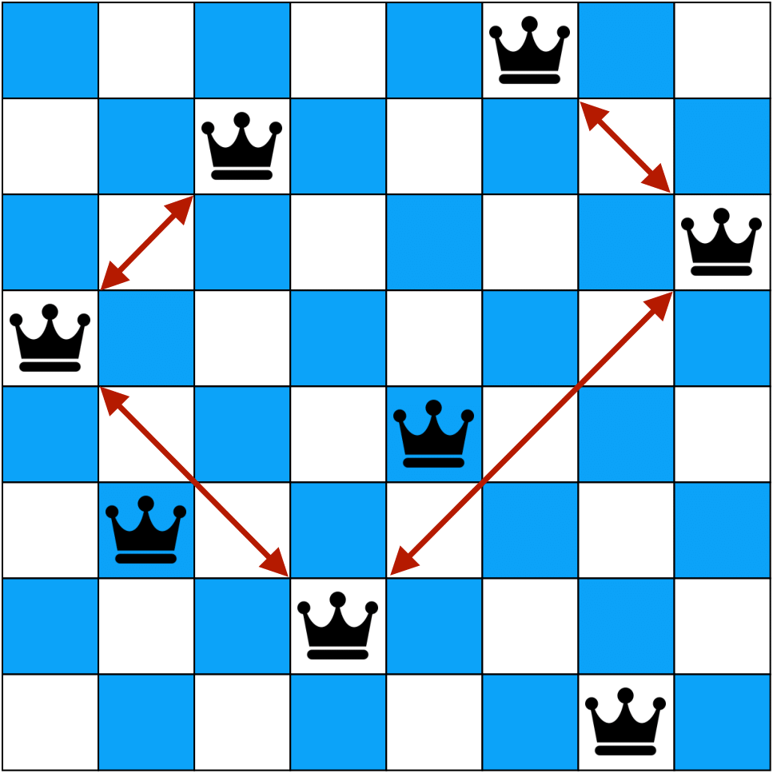

# Objective
This is a very simple python project that implements the idea of Genetic Algorithms in order to solve the N-queens problem.

# N-queens problem
Given a NxN chess board, the goal is to place N queens such that no to queens attack each other. This means that according to the chess rules, the queens must not be in the same row, column and diagonal.

